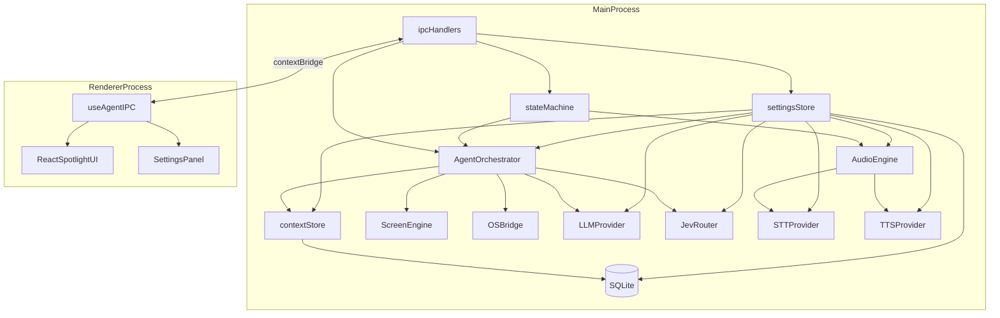
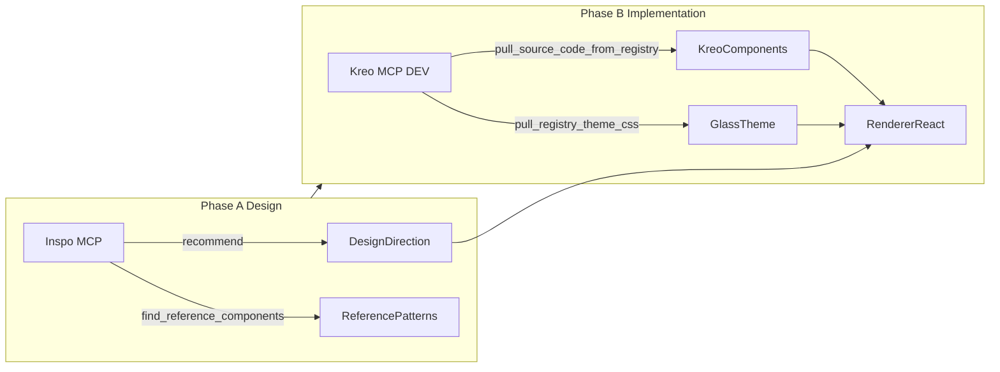
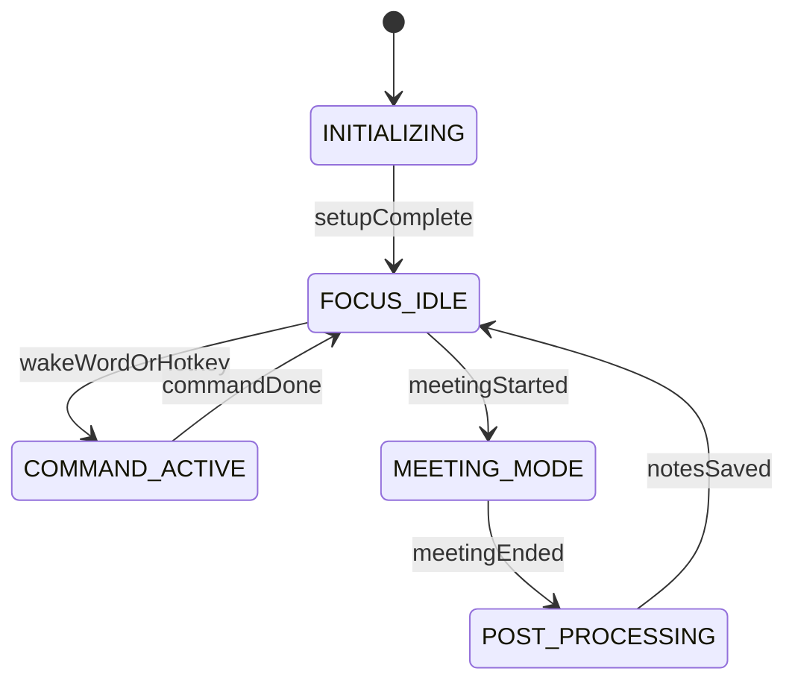

# Ambient Mac Copilot — Plan de Implementación

> **Proyecto:** `ambient-mac-copilot`  
> **Raíz del repo:** `/Volumes/HDJorge/Desarrollos/jacj/asistente-mac`  
> **Stack:** Electron + Vite + React + TypeScript + Kreo UI + SQLite  
> **Última actualización:** 2026-09-23  
> **Nota:** No usar la carpeta `Sin título/` — todo el código vive en la raíz `asistente-mac/`.

## Resumen

Greenfield ambient-mac-copilot: Electron + Kreo/Inspo UI, SQLite with encrypted secrets, multi-provider per-agent bindings, Jev router, Moonshine/Kokoro local voice, stereo meeting recording, onboarding, chat multihilo persistente, macOS packaging.

## Todos de implementación

- [ ] **step1-scaffold** — Scaffold electron-vite React-TS, Tailwind v4, LSUIElement, tray, shortcuts, Kreo glass theme bootstrap via MCP
- [ ] **step2-bridge** — Implement OS bridge modules (osascript, mail, system, media, notes) with AppleScript wrappers
- [ ] **step3-screen** — Implement screenCapture.ts with permission checks and primary display matching
- [ ] **step4-agent** — Build LLM provider, Jev fast-router (System One), orchestrator, toolRegistry, meetingSummarizer, IPC
- [ ] **step-settings** — SQLite store, encrypted secrets, multi-provider + agent bindings UI, audio device picker
- [ ] **step-onboarding** — First-launch onboarding wizard (permissions, BlackHole, model downloads, provider setup)
- [ ] **step-packaging** — electron-builder, entitlements, hardened runtime, macOS notarization
- [ ] **step-context** — SQLite chat threads + message persistence, multithread UI, context store IPC
- [ ] **step5-audio** — State machine + Porcupine, Moonshine STT, Kokoro TTS (kokoro-js), macOS say fallback, meeting pipeline
- [ ] **step6-renderer** — Bootstrap Kreo UI (MCP pull + glass theme) and build renderer with Command, SettingsLayout, cards, Sonner
- [ ] **step6-inspo** — Run Inspo MCP recommend/search before UI; apply Raycast/Linear design tokens to Kreo glass theme
- [ ] **step6-kreo** — Pull Kreo components via MCP DEV workflow (theme, Command, InputText, Card, StatusPill, SettingsLayout, Sonner)
- [ ] **docs-env** — Add README files and prerequisite setup docs (BlackHole, Porcupine, permissions, Settings UI reference)

---

# Ambient Mac Copilot Implementation Plan

## Current State

The workspace (`/Volumes/HDJorge/Desarrollos/jacj/asistente-mac`) contains only an empty git repo—no application code yet. Everything will be scaffolded from scratch **directly at the workspace root** (`/Volumes/HDJorge/Desarrollos/jacj/asistente-mac`). **No usar** la carpeta `Sin título/`.

## Architecture Overview



---

## UI Design Stack: Inspo MCP + Kreo UI MCP

The renderer **does not use hand-rolled CSS** as the primary UI layer. Design direction comes from **Inspo MCP**; implementation uses **Kreo UI components** pulled via **Kreo MCP** (`https://uicompos.kreoint.mx/mcp`, configured in Cursor as `kreo`).



### Phase A — Inspo MCP (before writing UI code)

Endpoint: `https://inspomcp.dev/api/mcp` (configured as `inspo`).

| Tool | Purpose for this app |
| --- | --- |
| `recommend({ brief })` | **Start here.** Brief: *macOS ambient copilot command palette, dark translucent glass modal, productivity like Raycast or Linear, compact chat + settings* |
| `search_screens({ query: "command palette dark" })` | Find Raycast/Linear-like captures |
| `get_design_system({ slug })` | Palette, type ramp, spacing, radii from reference (Linear, Raycast, etc.) |
| `find_reference_components({ type: "command" })` | Canonical command-palette patterns |
| `get_reference_jsx({ type, id })` | Layout reference to adapt into Kreo `Command` |
| `compare({ slugs: [...] })` | Choose between 2–3 candidate aesthetics |

**Output:** `src/renderer/design-direction.md` — macrostructure, reference slugs, token mapping to Kreo `--*`.

### Phase B — Kreo MCP DEV workflow

Use **[DEV]** workflow only (real Electron app — not Storybook PROTOTYPE).

**Bootstrap sequence:**

1. `ping_mcp` — verify connectivity
2. `pull_registry_theme_css({ preset: "glass" })` — OKLCH glass theme + macOS vibrancy alignment
3. `pull_registry_utils_code` + `pull_registry_tailwind_config` — merge into renderer
4. `get_dependencies_for_components({ names: [...] })` — npm deps for pulled set only
5. `pull_source_code_from_registry({ name })` — one component at a time → `src/renderer/src/components/`

**Component mapping:**

| UI surface | Kreo component |
| --- | --- |
| Spotlight shell | `Command` |
| Chat input | `InputText` (floatingLabel) |
| State pill | `StatusPill` |
| Action cards | `Card`, `Button`, `Checkbox` |
| Settings | `SettingsLayout` + `DynamicForm` fields |
| Chat ↔ Settings tabs | `TabView` (pills) |
| Toasts | `Sonner` |
| Meeting summary | `Timeline` or `Card` |
| List motion | `StaggerGroup`, `Reveal` |

**Kreo rules:** import `@/components/{layer}/{Name}`; use `var(--*)` tokens; motion via `@/lib/motion` if needed.

Reference: `kreo-ui-compos/mcp-server/README.md`

---

## Configuration Model (UI-first, SQLite-backed)

Non-secret settings and **all chat history** live in **SQLite** (`userData/copilot.db`). API keys and Picovoice key are stored **encrypted at rest** in the same DB — never in plain JSON.

### Storage architecture

```
userData/
├── copilot.db              # SQLite: providers, secrets, threads, messages, preferences
└── models/                 # Moonshine + Kokoro ONNX caches (filesystem)
```

**Stack:** `better-sqlite3` (main process only) + AES-256-GCM column encryption for secrets.

**Encryption key derivation:**
1. On first launch, generate 32-byte master key → persist via Electron **`safeStorage`** (macOS Keychain-backed).
2. Encrypt `api_key` / `picovoice_access_key` with master key + random IV per row before INSERT.
3. Renderer never receives decrypted secrets — only masked placeholders (`••••••••`).

```
src/main/db/
├── database.ts           # better-sqlite3 singleton, migrations
├── migrations/           # 001_initial.sql, 002_threads.sql, …
├── secretsCrypto.ts      # encrypt/decrypt using safeStorage master key
├── providerRepository.ts # CRUD providers + encrypted api_key
└── contextRepository.ts  # threads + messages
```

**Provider profile split:**

| Field | Storage |
| --- | --- |
| `id`, `name`, `preset`, `baseUrl`, `supportsSystemOne` | `providers` table (plain) |
| `apiKey` | `provider_secrets` table (`api_key_enc` BLOB) |
| Agent bindings, STT/TTS, audio prefs | `app_preferences` JSON column or normalized tables |

`ProviderProfile` in TypeScript UI types uses `apiKey?: string` only on **write**; reads return `apiKeyMasked: true`.

### Multi-provider + per-agent model bindings

Instead of a single global `llm.*` block, Settings manages **N proveedores** and assigns **proveedor + modelo** independently to each agente interno.

```typescript
export type ProviderPreset = 'openrouter' | '9router' | 'custom'

export interface ProviderProfile {
  id: string
  name: string
  preset: ProviderPreset
  baseUrl: string
  supportsSystemOne: boolean
  // apiKey: write-only via updateProviderSecret(); never returned decrypted to renderer
}

export type AgentId =
  | 'orchestrator'      // chat + tool loop principal
  | 'jev'               // System One fast router
  | 'screenVision'      // análisis multimodal de pantalla
  | 'meetingSummarizer' // minutas post-reunión
  | 'cloudStt'          // STT cloud fallback (Moonshine auto)

export interface AgentModelBinding {
  providerId: string            // referencia a ProviderProfile.id
  model: string
  enabled: boolean              // ej. desactivar Jev sin borrar binding
}

export interface AppSettings {
  providers: ProviderProfile[]
  agents: Record<AgentId, AgentModelBinding>
  jev: { minConfidence: number }
  stt: {
    provider: 'moonshine' | 'cloud' | 'auto'
    language: string
    liveModelArch: string
    meetingModelArch: string
  }
  tts: {
    provider: 'kokoro' | 'macos' | 'auto'
    voice: string
    speed: number
    dtype: 'q8' | 'fp32'
    outputDeviceId: string | 'default' | 'headphones-preferred'
  }
  audio: {
    wakeWord: string
    blackholeDeviceIndex: number
    ffmpegPath: string
    // picovoiceAccessKey: encrypted in secrets table (key: 'picovoice')
  }
}
```

**Defaults on first launch:**

| Provider `id` | Preset | baseUrl |
| --- | --- | --- |
| `openrouter-main` | openrouter | `https://openrouter.ai/api/v1` |
| `9router-local` | 9router | `http://localhost:20128/v1` |

| Agent | Default provider | Default model |
| --- | --- | --- |
| `orchestrator` | `openrouter-main` | `google/gemini-2.0-flash-001` |
| `jev` | `openrouter-main` | `~typesafe/jev-latest` |
| `screenVision` | `openrouter-main` | `google/gemini-2.0-flash-001` |
| `meetingSummarizer` | `openrouter-main` | `google/gemini-2.0-flash-001` |
| `cloudStt` | `9router-local` | `openai/whisper-1` |

**Resolver en runtime** — `src/main/config/providerRegistry.ts`:

```typescript
getProvider(id: string): ProviderProfile
getLLMClientForAgent(agentId: AgentId): OpenAICompatibleProvider
resolveSystemOneUrl(provider: ProviderProfile): string | null  // null si !supportsSystemOne
```

Each agent module calls `getLLMClientForAgent('orchestrator')` etc. — **no shared singleton** tied to one gateway.

### Settings UI — two sections (Kreo `SettingsLayout`)

**1. Proveedores** (`ProviderListPanel.tsx`)
- Tabla/cards: nombre, preset, base URL, API key enmascarada
- Acciones: Añadir, Editar, Eliminar (mín. 1 proveedor)
- Checkbox **Supports System One (Jev)** + auto-detect al probar conexión
- Botón **Test connection** por proveedor (`settings:test-provider`)

**2. Agentes** (`AgentBindingsPanel.tsx`)
- Tabla fija de 5 filas (agentes internos):

| Agente | Proveedor ▼ | Modelo | Activo | Test |
| --- | --- | --- | --- | --- |
| Orchestrator | dropdown `providers[]` | text | — | ping chat |
| Jev Router | dropdown | `~typesafe/jev-latest` | toggle | systemone probe |
| Screen Vision | dropdown | multimodal model | — | ping |
| Meeting Summarizer | dropdown | model | — | ping |
| Cloud STT | dropdown | whisper model | — | optional |

- Dropdown de proveedor filtra: Jev solo muestra proveedores con `supportsSystemOne === true`
- Si Jev apunta a `9router-local` sin System One → fila en warning + toggle disabled

### Built-in provider presets (al crear proveedor)

| Preset | Default `baseUrl` | Notes |
| --- | --- | --- |
| **OpenRouter** | `https://openrouter.ai/api/v1` | Adds optional `HTTP-Referer` / `X-Title` headers |
| **9router** | `http://localhost:20128/v1` | Local gateway; API key from 9router dashboard (or empty if auth disabled) |
| **Custom** | user-defined | Ollama, LiteLLM, etc. |

Al seleccionar preset al **crear/editar proveedor**, auto-rellena `baseUrl`; API key se guarda cifrada en SQLite vía `updateProviderSecret()`.

### Settings store — `src/main/config/settingsStore.ts`

- Facade sobre `providerRepository` + `contextRepository` + `app_preferences` table.
- `getSettings()`, `updateSettings(partial)`, `getProviderRegistry()` (keys masked).
- Validate agent bindings with zod; emit `settings:changed` → hot-reload agent clients.

### Settings IPC (preload additions)

```typescript
getSettings(): Promise<AppSettingsPublic>
updateSettings(partial): Promise<void>
testProviderConnection(providerId: string): Promise<{ ok: boolean; supportsSystemOne?: boolean; error?: string }>
testAgent(agentId: AgentId): Promise<{ ok: boolean; error?: string }>
listAudioOutputDevices(): Promise<AudioDevice[]>
```

### Chat context store (multihilo + persistencia)

MDD **Context Store** + chat multihilo — backed by SQLite, main process only.

**Schema:**

```sql
CREATE TABLE chat_threads (
  id TEXT PRIMARY KEY,
  title TEXT NOT NULL,
  created_at INTEGER NOT NULL,
  updated_at INTEGER NOT NULL
);
CREATE TABLE chat_messages (
  id TEXT PRIMARY KEY,
  thread_id TEXT NOT NULL REFERENCES chat_threads(id),
  role TEXT NOT NULL,           -- user | assistant | system
  content TEXT NOT NULL,
  action_data TEXT,             -- JSON for MailTriageCard etc.
  created_at INTEGER NOT NULL
);
```

**Module:** `src/main/agent/contextStore.ts`

- `listThreads()`, `createThread(title?)`, `getThread(id)`, `deleteThread(id)`
- `appendMessage(threadId, message)`, `getMessages(threadId, limit?)`
- Orchestrator appends user + assistant turns; voice commands use **active thread** from UI
- Default thread `"general"` on first launch

**IPC:**

```typescript
listThreads(): Promise<ChatThread[]>
createThread(title?: string): Promise<ChatThread>
switchThread(threadId: string): Promise<void>
getMessages(threadId: string): Promise<ChatMessage[]>
deleteThread(threadId: string): Promise<void>
```

**UI:** `ThreadListPanel.tsx` — sidebar o dropdown en `ChatPanel` (Kreo `TabView` o lista compacta estilo Raycast); `Cmd+N` nuevo hilo; título auto desde primer mensaje del usuario.

### Audio output routing (TTS privado)

MDD: feedback por **audífonos**. Settings → Voz:

| Modo `tts.outputDeviceId` | Comportamiento |
| --- | --- |
| `headphones-preferred` (default) | Detectar dispositivo de salida con `portType === 'Built-in Output'` vs Bluetooth/USB headset; preferir headset si conectado |
| `default` | Sistema default output |
| `{deviceId}` | Dispositivo fijo elegido en dropdown |

**Fallback chain:**
1. Kokoro → WAV → `afplay -d '{deviceId}'` (or `SwitchAudioSource` / CoreAudio device UID)
2. Si `headphones-preferred` y **no hay audífonos** → toast Sonner "Conecta audífonos o elige salida en Ajustes" + opción: reproducir en altavoz / silenciar / usar solo UI chat
3. Si Kokoro falla → macOS `say` al mismo device target

**Module:** `src/main/audio/audioOutput.ts` — `listOutputDevices()`, `resolveOutputDevice(preference)`, `playWav(path, deviceId)`.

---

## Prerequisites (document in root README)

Before Step 5 works end-to-end, the user must install/configure:

| Dependency | Purpose | Configured in UI |
| --- | --- | --- |
| **BlackHole 2ch** | System audio loopback for dual-channel meeting recording | `audio.blackholeDeviceIndex` |
| **Picovoice Access Key** | Porcupine wake-word engine | `audio.picovoiceAccessKey` |
| **LLM gateways** | Multi-provider registry; per-agent model bindings | Settings → Proveedores + Agentes |
| **Moonshine (local STT)** | On-device transcription for wake-word commands + meetings | `stt.*` |
| **Kokoro (local TTS)** | On-device neural speech feedback through headphones | `tts.*`; model ~80MB cached in `userData/kokoro/` |
| **ffmpeg** | Dual-stream meeting recorder | `audio.ffmpegPath` |
| **macOS permissions** | Microphone, Screen Recording, Accessibility, Automation | OS System Settings |

---

## Step 1 — Scaffolding & Window Management

**Goal:** Runnable Electron shell with tray, hidden dock icon, and global hotkey.

### 1.1 Project bootstrap

- Scaffold with **electron-vite** React-TS template:
  ```bash
  cd /Volumes/HDJorge/Desarrollos/jacj/asistente-mac
  npm create electron-vite@latest . -- --template react-ts
  ```
- Adjust `package.json`: name `ambient-mac-copilot`, scripts `dev` / `build` / `preview`.
- Add runtime deps: `openai`, `@picovoice/porcupine-node`, `@picovoice/pvrecorder-node`, `@moonshine-ai/moonshine-wasm`, `kokoro-js`, `better-sqlite3`, `zod`, `tailwindcss`, `@tailwindcss/vite`, `lucide-react`, `clsx`, `tailwind-merge`.
- Add dev deps: `@types/node`, `@types/better-sqlite3`, `electron-builder`.
- Replace `electron-store` with **SQLite** (see Configuration Model).
- **No `dotenv` dependency** — configuration is UI-managed.
- Renderer: configure **Tailwind v4** + `@tailwindcss/vite` in `electron.vite.config.ts`; alias `@` → `src/renderer/src`.
- After scaffold, run **Kreo MCP Phase B bootstrap** (theme `glass`, utils, tailwind merge) before building UI components.

### 1.2 electron.vite.config.ts

- Configure three entry points: `main`, `preload`, `renderer`.
- Set `build.rollupOptions.external` for native modules (`@picovoice/*`).
- Renderer: React plugin, alias `@` → `src/renderer/src`.

### 1.3 Main process shell — `src/main/index.ts`

Key behaviors:

- Initialize **`database`** + migrations + **`settingsStore`** on startup.
- First launch → show **`OnboardingWizard`** (see below) before entering `FOCUS_IDLE`.
- **`LSUIElement: true`** — set in `build/entitlements.mac.plist` or electron-builder `extendInfo` in `electron-builder.yml` to hide dock icon.
- Create **frameless, transparent** BrowserWindow:
  - `width: 680`, `height: 420`, centered
  - `frame: false`, `transparent: true`, `vibrancy: 'under-window'` (macOS)
  - `alwaysOnTop: true`, `skipTaskbar: true`, `show: false`
  - `titleBarStyle: 'hidden'`
- **System Tray** with menu: Show/Hide Copilot, **Settings…**, Quit.
- **Global shortcut** `Command+Shift+Space` toggles window visibility + focus.
- **Global shortcut** `Command+,` opens Settings tab when window is visible.
- Register IPC handlers stub (wired in Step 4).
- On `app.ready`, transition state machine to `FOCUS_IDLE`.

### 1.4 Preload stub — `src/preload/index.ts`

Expose typed `ElectronAPI` via `contextBridge.exposeInMainWorld('electronAPI', …)` matching MDD contract:

```typescript
interface ElectronAPI {
  sendUserMessage(text: string): Promise<{ reply: string; actionData?: unknown }>
  requestScreenAnalysis(query: string): Promise<{ analysis: string }>
  onStateChange(cb: (state: string) => void): void
  onMeetingStatusUpdate(cb: (data: { status: string; duration?: number }) => void): void
  // threads — see context store IPC
  listThreads(): Promise<ChatThread[]>
  createThread(title?: string): Promise<ChatThread>
  switchThread(threadId: string): Promise<void>
  getMessages(threadId: string): Promise<ChatMessage[]>
}
```

### 1.5 First-launch onboarding — `OnboardingWizard.tsx`

Shown once (`app_preferences.onboarding_completed === false`) as modal full-screen Kreo wizard:

| Step | Content |
| --- | --- |
| 1. Welcome | Qué hace el copilot ambient |
| 2. Permissions | Micrófono, Screen Recording, Accessibility — botones "Abrir Preferencias del Sistema" + status pills |
| 3. Automation | Mail, Notes, Reminders — explicar Automation prompts |
| 4. BlackHole | Guía Multi-Output Device + enlace a audio README; validar ffmpeg path |
| 5. Models | Progress bars: Moonshine STT + Kokoro TTS first download (warm-up) |
| 6. Providers | Mínimo 1 proveedor con API key (cifrada en SQLite) + test connection |
| 7. Done | `Cmd+Shift+Space` shortcut reminder |

IPC: `onboarding:get-status`, `onboarding:complete`, `permissions:check-all`, `models:download-progress` (event stream).

Re-openable from tray: **Setup Assistant…**

### 1.6 macOS packaging — `electron-builder.yml`

- **Target:** `dmg` + `zip` (macOS arm64 + x64 universal or arm64-only per decision)
- **`LSUIElement: true`** in `extendInfo`
- **Entitlements** (`build/entitlements.mac.plist`): microphone, audio-input, screen-capture, automation (Apple Events), hardened runtime
- **Native deps:** `@picovoice/*`, `better-sqlite3` — `electron-rebuild` postinstall script
- **Notarization:** `afterSign` hook with `@electron/notarize` (requires `APPLE_ID`, `APPLE_APP_SPECIFIC_PASSWORD`, `APPLE_TEAM_ID` in CI — document for local dev ad-hoc sign)
- **ExtraResources:** optional bundled ffmpeg or document Homebrew path

---

## Step 2 — OS Bridge (AppleScript Services)

**Goal:** Testable, sandboxed macOS integrations invoked only from main process.

### File layout

```
src/main/bridge/
├── osascript.ts       # Safe execFile wrapper (MDD spec)
├── mailService.ts     # Inbox triage, read, archive
├── systemService.ts   # Empty trash, process helpers
├── mediaService.ts    # Apple Music / Spotify controls
└── notesService.ts    # Notes + Reminders CRUD
```

### Implementation notes

- **`osascript.ts`**: Use MDD implementation verbatim; add input sanitization helper `escapeAppleScriptString()` to prevent injection in interpolated scripts.
- **`mailService.ts`**:
  - `fetchUnreadEmails(limit)` — AppleScript query on Mail.app inbox
  - `archiveMessages(ids[])` — move to Archive mailbox
  - `mailTriageInbox({ limit, autoArchiveJunk })` — orchestrates fetch + heuristic archive (newsletter/subject patterns)
- **`systemService.ts`**: `emptyTrash()`, `runMaintenance(action)` enum handler
- **`mediaService.ts`**: `musicPlay(playlist?)`, `musicPause()`, `musicNext()` via Music.app AppleScript
- **`notesService.ts`**:
  - `createNote(title, content, folder: "Reuniones")`
  - `createReminder(title, dueDateIso?)`

Each module exports plain async functions; no Electron imports. Add a lightweight `bridge/index.ts` re-export barrel for orchestrator consumption.

---

## Step 3 — Screen Engine

**Goal:** Primary-display JPEG capture for multimodal LLM payloads.

### `src/main/screen/screenCapture.ts`

- Implement per MDD using `desktopCapturer.getSources({ types: ['screen'] })`.
- Enhancements beyond MDD:
  - Match source by `display_id` from `screen.getPrimaryDisplay()` rather than `sources[0]`.
  - Request `systemPreferences.getMediaAccessStatus('screen')` and surface a clear IPC error if denied.
  - Export both `captureActiveDisplayBase64()` and `captureActiveDisplayBuffer()` for meeting/post-processing reuse.

---

## Step 4 — Agent, Jev Router & Function Calling

**Goal:** Fast structured routing with **Jev (System One)** before the full LLM loop; provider-agnostic chat/vision via OpenAI-compatible gateway.

### 4.0 Jev intent router (pre-orchestrator fast path)

Jev **no genera texto** — devuelve decisiones tipadas con probabilidad en ~70–500ms. Encaja entre STT/chat input y el orchestrator LLM costoso.

```
User text (chat or Moonshine STT)
        │
        ▼
┌───────────────────┐
│  JevRouter        │  uses agents.jev → provider with supportsSystemOne
│  (if enabled)     │
└─────────┬─────────┘
          │
    confidence ≥ 0.70?
          │
    ┌─────┴─────┐
    ▼           ▼
 fast-path    full LLM
 (1 tool)     orchestrator
    │           │
    └─────┬─────┘
          ▼
    toolRegistry → OS bridge / screen
          ▼
    reply text → Kokoro TTS (voice) or chat UI
```

**Files:**

```
src/main/agent/jev/
├── openrouterJevClient.ts    # port pattern from kreo/eodin openrouter-jev.client.ts
├── intentPlaybooks.ts        # choice criteria → AGENT_TOOLS mapping
└── jevRouter.ts              # classify(userText) → { tool, args?, confidence }
```

**Jev question (single `choice`):**

| Choice ID | Maps to | When |
| --- | --- | --- |
| `mail_triage` | `mail_triage_inbox` | Correo, inbox, spam, newsletters |
| `screen_analysis` | `analyze_current_screen` | Pantalla, error visible, qué hay en pantalla |
| `system_action` | `manage_system` | Basura, música, play/pause |
| `reminder_note` | `create_reminder_note` | Recordatorio, nota, tarea |
| `general_chat` | — (fallback LLM) | Preguntas abiertas, razonamiento |
| `complex` | — (fallback LLM) | Multi-paso, ambiguo |

**Fast-path behavior:** if Jev picks a tool with confidence ≥ `settings.jev.minConfidence`, call `executeTool()` directly; use a short template reply (or mini LLM polish optional). If Jev fails, timeout, or picks `general_chat`/`complex` → full orchestrator.

**Gateway binding:**
- Jev uses `getLLMClientForAgent('jev')` + `resolveSystemOneUrl(providers[agents.jev.providerId])`.
- Skip Jev fast-path when `agents.jev.enabled === false` OR provider lacks `supportsSystemOne` (typical for 9router — user can still bind orchestrator to 9router and Jev to OpenRouter).
- `jev.minConfidence` global threshold (default 0.70).

**Not used for:** meeting summarizer prose (uses `agents.meetingSummarizer`), Kokoro/Moonshine pipelines.

### 4.1 LLM provider abstraction

```
src/main/agent/llm/
├── types.ts
├── OpenAICompatibleProvider.ts
├── presets.ts
├── createLLMProvider.ts         # factory from ProviderProfile (not global settings)
└── index.ts

src/main/config/
├── settingsStore.ts
└── providerRegistry.ts          # getLLMClientForAgent(agentId)
```

- **`createLLMProvider(profile: ProviderProfile)`** — one client instance per provider profile.
- **`getLLMClientForAgent(agentId)`** — resolves binding → provider → client (cached map, rebuilt on `settings:changed`).
- **`transcribeAudio`** on cloud STT client uses `agents.cloudStt` binding (often 9router whisper).
- **`meetingSummarizer`** and **`screenVision`** use their own bindings (can differ from orchestrator model).

### 4.2 Tool registry — `src/main/agent/toolRegistry.ts`

- Copy MDD `AGENT_TOOLS` definitions.
- Add `executeTool(name, args)` dispatcher mapping:
  - `mail_triage_inbox` → `mailService.mailTriageInbox`
  - `analyze_current_screen` → `screenCapture` + follow-up LLM vision call
  - `manage_system` → `systemService` + `mediaService`
  - `create_reminder_note` → `notesService`

### 4.4 Orchestrator — `src/main/agent/orchestrator.ts`

- Receives clients via `getLLMClientForAgent('orchestrator')` + `JevRouter`.
- **`run(userText, threadId)` flow:**
  1. Load last N messages from `contextStore.getMessages(threadId)` as LLM context window.
  2. If Jev enabled → `tryFastPath`.
  3. Else full orchestrator loop.
  4. Append user + assistant messages to SQLite; return `{ reply, actionData }`.
- **`testConnection()`**: sends minimal `{ role: 'user', content: 'ping' }` completion; used by Settings UI "Test connection" button.

### 4.4 Meeting summarizer — `src/main/agent/meetingSummarizer.ts`

- Input: full meeting transcript string.
- Output JSON schema: `{ title, summary, actionItems[], decisions[], followUpReminders[] }`.
- Persist via `notesService.createNote` (folder "Reuniones") and create Reminders for each action item.

### 4.5 IPC handlers — `src/main/ipc/ipcHandlers.ts`

| Channel | Handler |
| --- | --- |
| `agent:send-message` | `orchestrator.run(userText)` |
| `agent:screen-analysis` | capture + orchestrator with vision |
| `state:subscribe` | push state machine transitions to renderer |
| `settings:get` | return masked settings for UI |
| `settings:update` | validate providers + agent bindings → persist → hot-reload all agent clients |
| `settings:test-provider` | probe chat endpoint + optional System One for Jev |
| `settings:test-agent` | minimal ping using that agent's provider+model |

---

## Step 5 — Audio Engine & State Machine

**Goal:** Full wake-word + meeting lifecycle with **local Moonshine STT** (private, offline-capable) and optional cloud fallback.

### 5.0 STT provider abstraction (decoupled from LLM)

```
src/main/audio/stt/
├── types.ts                    # TranscriptResult, StreamingSTT interface
├── MoonshineSTTProvider.ts     # @moonshine-ai/moonshine-wasm in main process
├── CloudSTTProvider.ts           # delegates to LLMProvider.transcribeAudio
├── createSTTProvider.ts          # factory from settingsStore
└── index.ts
```

| Provider | When | Implementation |
| --- | --- | --- |
| **`moonshine`** (default) | Wake-word utterances + meeting WAV | `@moonshine-ai/moonshine-wasm` — `MicTranscriber` for live, file API for batch |
| **`cloud`** | User prefers API quality | Uses `agents.cloudStt` provider+model (e.g. 9router + whisper) |
| **`auto`** | Best of both | Moonshine first; on error/timeout → cloud fallback |

**Moonshine integration details:**

- **Live (COMMAND_ACTIVE):** after wake word, start `MicTranscriber` with `settings.stt.liveModelArch` (default `medium-streaming`), language `es`, stop on silence/end-of-utterance → return final line text.
- **Meeting (POST_PROCESSING):** transcribe `$TMPDIR/meeting_*.wav` with batch API / `moonshine-voice transcribe` equivalent using `settings.stt.meetingModelArch` (default `base` — better for long audio than streaming arch).
- **Model assets:** Moonshine downloads models on first `load()` to app cache (`userData/moonshine/`); document size (~100–500 MB depending on arch) in README.
- **CLI fallback:** if WASM fails in packaged Electron, spawn `moonshine-voice transcribe --language es path.wav` (optional path in settings later).

**Why Moonshine over Whisper.cpp:** native macOS support, streaming partial text (lower perceived latency), Spanish built-in; fits ambient/private copilot goals without sending voice to cloud.

### 5.0b TTS provider abstraction (decoupled, local-first)

```
src/main/audio/tts/
├── types.ts                    # SpeakOptions, TTSProvider interface
├── KokoroTTSProvider.ts        # kokoro-js in main process (ONNX, CPU)
├── MacOSTTSProvider.ts           # macOS `say` + `afplay` fallback
├── createTTSProvider.ts
└── index.ts
```

| Provider | When | Implementation |
| --- | --- | --- |
| **`kokoro`** (default) | Private headphone feedback after commands | `kokoro-js` — `KokoroTTS.from_pretrained('onnx-community/Kokoro-82M-v1.0-ONNX', { dtype, device: 'cpu' })` |
| **`macos`** | Zero model download / system voices | `say -o /tmp/tts.aiff` + `afplay` (MDD original) |
| **`auto`** | Resilience | Kokoro first; on load/generate error → macOS `say` |

**Kokoro integration details:**

- **Model:** `onnx-community/Kokoro-82M-v1.0-ONNX`, cached under `userData/kokoro/` (~80MB q8).
- **Spanish voices** (lang_code `e`): `ef_dora` (default), `em_alex`, `em_santa` — configurable in Settings.
- **Short replies (COMMAND_ACTIVE):** `tts.generate(...)` → WAV → `audioOutput.playWav()` on resolved device (see Audio Output routing).
- **Long assistant replies:** `tts.stream()` + `TextSplitterStream` — stream sentences to reduce time-to-first-audio.
- **MEETING_MODE:** TTS **hard-blocked** (no room noise) — unchanged from MDD.
- **Singleton:** lazy-load Kokoro model once on first speak; warm-up optional from Settings "Test TTS".

Reference: [kokoro-electron](https://github.com/davealaw/kokoro-electron) proves `kokoro-js` works in Electron main/renderer pattern.

### 5.1 State machine — `src/main/state/stateMachine.ts`



- Typed enum + event emitter (`EventEmitter`).
- Public API: `transition(event)`, `getState()`, `onStateChange(cb)`.
- Side effects delegated to audio modules (start/stop listeners, mute TTS).

### 5.2 Audio modules

| File | Responsibility |
| --- | --- |
| `wakeWord.ts` | Porcupine + PvRecorder; reads settings; emits `wakeWordDetected`; restarts on settings save |
| `speechToText.ts` | Facade over `createSTTProvider()` — `transcribeLive()` for commands, `transcribeFile(wavPath)` for meetings |
| `textToSpeech.ts` | Facade over `createTTSProvider()` — `speak(text)` routes to Kokoro or macOS `say`; **no-op in MEETING_MODE** |
| `meetingDetector.ts` | Poll `ps` for Zoom/Teams/Chrome+Meet; monitor mic usage via CoreAudio (or heuristic: known bundle IDs using mic) |
| `meetingRecorder.ts` | **Stereo WAV** `$TMPDIR/meeting_<timestamp>.wav`: **L=mic, R=BlackHole** (system audio); ffmpeg `amerge` |

### 5.3 Integration wiring in `index.ts`

- On `FOCUS_IDLE`: start wake-word listener.
- On `COMMAND_ACTIVE`: pause wake-word → STT → orchestrator → TTS → return to idle.
- On `MEETING_MODE`: stop wake-word, start dual recorder, suppress TTS.
- On `POST_PROCESSING`: stop recorder → STT full audio → `meetingSummarizer` → Notes/Reminders → idle.

### 5.4 Meeting recorder — stereo WAV spec

**Output:** single file `meeting_<timestamp>.wav`, **stereo 16-bit PCM**:

| Channel | Source |
| --- | --- |
| **Left (0)** | Default microphone (user voice) |
| **Right (1)** | BlackHole loopback (Zoom/Meet/Teams system audio) |

**ffmpeg example (conceptual):**

```bash
ffmpeg -f avfoundation -i ":{micIndex}" -f avfoundation -i ":{blackholeIndex}" \
  -filter_complex "[0:a][1:a]amerge=inputs=2[aout]" -map "[aout]" \
  -ac 2 -ar 16000 meeting_<ts>.wav
```

Device indices from Settings (`audio.blackholeDeviceIndex`, mic auto-detected). Document BlackHole + Multi-Output setup in `src/main/audio/README.md`.

Emit `meeting:status` IPC events with `{ status, duration }` for renderer cards.

---

## Step 6 — Renderer UI (Kreo + Inspo)

**Goal:** Raycast/Spotlight-style translucent chat built with **Kreo UI components**, styled from **Inspo MCP** design references — not custom CSS-first.

### 6.0 Pre-work (MCP, blocking)

1. **Inspo:** call `recommend` + `get_design_system` on top reference → write `design-direction.md`
2. **Kreo:** pull theme + components listed in UI Design Stack section
3. Map Inspo palette roles → Kreo CSS variables in `vars.css` if needed

### Structure

```
src/renderer/
├── design-direction.md
├── src/
│   ├── App.tsx
│   ├── components/
│   │   ├── kreo/
│   │   ├── ChatPanel.tsx
│   │   ├── ThreadListPanel.tsx
│   │   ├── OnboardingWizard.tsx
│   │   ├── ChatHistory.tsx
│   │   ├── MailTriageCard.tsx
│   │   ├── MeetingSummaryCard.tsx
│   │   ├── ProviderListPanel.tsx
│   │   ├── AgentBindingsPanel.tsx
│   ├── hooks/
│   │   ├── useAgentIPC.ts
│   │   └── useSettings.ts
│   ├── lib/
│   └── styles/
```

### Settings UI — `SettingsPanel.tsx`

Shell with Kreo `SettingsLayout` + sub-panels: `ProviderListPanel`, `AgentBindingsPanel`, plus Voz/Audio sections.

Built with **`SettingsLayout`** + Kreo tabs: **Chat | Settings** → sub-tabs **Proveedores | Agentes | Voz | Audio**

**Voz (STT/TTS/Jev threshold + salida de audio)**

- STT/TTS settings as before
- **Output device:** dropdown `headphones-preferred` | `default` | lista de dispositivos (`listAudioOutputDevices`)
- **Test TTS** plays through selected device

Save → `settings:update` → persist to SQLite + hot-reload main process.

### Chat UI behavior

- **App.tsx:** Kreo `Command` as root shell (Spotlight metaphor); `StatusPill` for state machine; `TabView` pills for Chat | Settings
- **ChatPanel.tsx:** active thread + `Command` input; `Cmd+N` new thread; history from SQLite via IPC
- **ChatHistory.tsx:** `StaggerGroup` for messages; inline `MailTriageCard` / `MeetingSummaryCard` when `actionData` present
- Electron frameless window vibrancy complements Kreo **glass** preset — avoid duplicating blur in component CSS

### Styling rules

- **No** standalone `spotlight.css` with hardcoded colors — use Kreo `vars.css` + Inspo-mapped tokens
- macOS SF Pro via Kreo typography tokens or system font stack in theme
- Reference Inspo slugs documented in `design-direction.md` for future design iterations

---

## Documentation (per workspace rules)

| Path | Contents |
| --- | --- |
| `README.md` | Setup, Settings UI reference, BlackHole/Porcupine install, permissions, dev/build commands |
| `src/main/db/README.md` | SQLite schema, AES encryption, migrations |
| `src/main/agent/README.md` | contextStore, orchestrator, Jev fast-path |
| `src/main/config/README.md` | settingsStore facade, agent bindings, hot-reload |
| `src/main/bridge/README.md` | AppleScript services + permission requirements |
| `src/main/audio/README.md` | Audio pipeline, BlackHole routing diagram, ffmpeg command |
| `src/renderer/README.md` | Kreo bootstrap, Inspo references, component map, design-direction.md |

---

## Default Settings (first launch)

| Field | Default |
| --- | --- |
| `providers` | `openrouter-main` + `9router-local` |
| `agents.orchestrator` | `openrouter-main` / `google/gemini-2.0-flash-001` |
| `agents.jev` | `openrouter-main` / `~typesafe/jev-latest` / enabled |
| `agents.screenVision` | `openrouter-main` / `google/gemini-2.0-flash-001` |
| `agents.meetingSummarizer` | `openrouter-main` / `google/gemini-2.0-flash-001` |
| `agents.cloudStt` | `9router-local` / `openai/whisper-1` |
| `jev.minConfidence` | `0.70` |
| `stt.provider` | `moonshine` |
| `stt.language` | `es` |
| `stt.liveModelArch` | `medium-streaming` |
| `stt.meetingModelArch` | `base` |
| `tts.provider` | `kokoro` |
| `tts.voice` | `ef_dora` |
| `tts.speed` | `1.0` |
| `tts.dtype` | `q8` |
| `tts.outputDeviceId` | `headphones-preferred` |
| `audio.picovoiceAccessKey` | `""` |
| `audio.wakeWord` | `computer` |
| `audio.blackholeDeviceIndex` | `1` |
| `audio.ffmpegPath` | `/opt/homebrew/bin/ffmpeg` |

**Switching to 9router for chat:** edit `agents.orchestrator` → provider `9router-local`, model `cc/claude-sonnet-4-5`; keep `agents.jev` on `openrouter-main` for System One.

---

## Verification Checklist

1. **Step 1:** Onboarding wizard on first launch; SQLite init; tray + shortcut; packaged `.dmg` signs locally.
2. **Step 2:** Run bridge unit smoke test from main: create a test Reminder via `notesService`.
3. **Step 3:** IPC screen capture returns valid base64; permission prompt appears once.
4. **Step 4:** Jev fast-path + multithread context in orchestrator; messages persist across app restart.
5. **Step 5:** Stereo meeting WAV (L=mic, R=BlackHole); Kokoro TTS to headphones with speaker fallback toast.
6. **Step 6:** Thread list UI; Settings saves encrypted API key; onboarding re-runnable from tray.

---

## Risk Mitigations

- **SQLite encryption:** if `safeStorage` unavailable (Linux dev), fallback to dev-only unencrypted with console warning — production macOS requires Keychain-backed master key.
- **better-sqlite3 native build:** rebuild for Electron ABI; include in postinstall.
- **Notarization:** CI secrets required for distribution; local dev uses ad-hoc sign.
- **Stereo drift:** mic vs BlackHole may desync over long meetings — document max duration or future resample fix.
- **Screen Recording permission:** Must be granted to the packaged app bundle, not just Terminal.
- **BlackHole routing:** User must set Multi-Output Device in Audio MIDI Setup; document with screenshot steps in audio README.
- **Kokoro first load:** ~80MB download; show progress; warm-up on Settings "Test TTS" to avoid latency on first command.
- **Kokoro + Electron:** run in **main process** only (`device: 'cpu'`); reference `kokoro-electron` patterns if WASM issues arise.
- **Moonshine WASM in Electron:** verify `@moonshine-ai/moonshine-wasm` loads in main process during dev; if packaged build fails, document CLI fallback (`pip install moonshine-voice`).
- **Model download on first run:** show progress in Settings or tray; block STT until first model cached.
- **Missing provider for agent:** block run with friendly error naming agent + provider id.
- **Jev on non-System-One provider:** UI warning on Agentes row; runtime skips Jev (orchestrator still works on any provider).
- **Jev low confidence:** never execute tools below `minConfidence` — fall back to orchestrator on its bound provider.
- **Provider switch at runtime:** editing bindings hot-reloads only affected agent clients.
- **AppleScript fragility:** Mail/Notes scripts vary by macOS version; wrap in try/catch and return user-friendly errors to chat.
